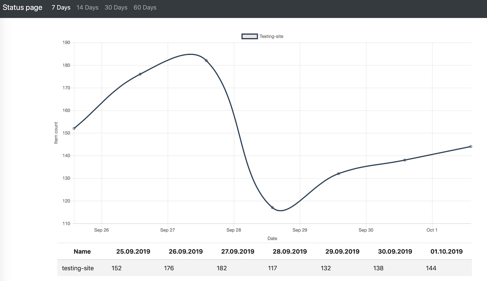

## Start a webserver with the status page



Use following input for starting a status page server:

```
{
    "task": "serve",
    "intervals": ["day", "week", "two-weeks", "month", "two-months"],
    "charts": [
        {
            "id": "my-chart-1",
            "name": "Name of my chart",
            "showTable": true
        },
        ...
    ]
}
```

- `intervals` - array with time intervals that should be displayed, possible value are `"day", "week", "two-weeks", "month", "two-months"`
- `charts` - array of charts that should be displayed on the dashboard
    - `id` - string - an unique id of this chart. Will be used to store data. 
    - `name` - string - name of chart that will be displayed on the dashboard
    - `showTable` - if `true` then there will be a table under the chart with the name of actor and daily dataset size

You will see following line in actor log:

```
Listenig on https://ar2nyyoqxcnn.runs.apify.net!
```

Copy this url to your browser and get ready to be amazed 😎🍿

## Storing data

You can use a webhooks to store dataset statistics to the dashboard or call it using `Apify.call` from your actor.
Use following input for storing a dataset info manually:

```
{
    "task": "store",
    "name": "actor-name",
    "datasetId": "datasetId",
    "chartId": "my-chart-1",
    "color": "#0084d5",
}
```

- name - string - a name of actor or site it crawles.
- datasetId - string - an id of dataset
- chartId - string - an id of a chart
- color - optional string - what color (in hex format) should be used to display data. If not set some color will be picked randomly.

### Using webhooks to store data

You can use webhooks for storing a data. Just create a webhook under your actor or task for `Run succeeded` event.
Set the url to start dashboard task. Actor will open default dataset of finished run and collect its statistics.

You can add a custom name to the payload template as `"name": "hackernews.com"`.
If there is no name set, then dashboard will lookup actor name and use that as a name for data line. 
Same with `color` or `chartId` attributes.  

## Persistent url

Every actor starts with public URL which is different for every run. 
You can use rebrand.ly app to have a persistent URL. 
Actor is prepared to update your rebrand.ly with every start. Just add this to the input:

```
 {
     "rebrandly": {
         "id": "LinkId",
         "apiKey": "YourApiKey",
         "workspace": "YourWorkspaceId",
         "title": "My cool dashboard"
     },
     ...
 }
```
